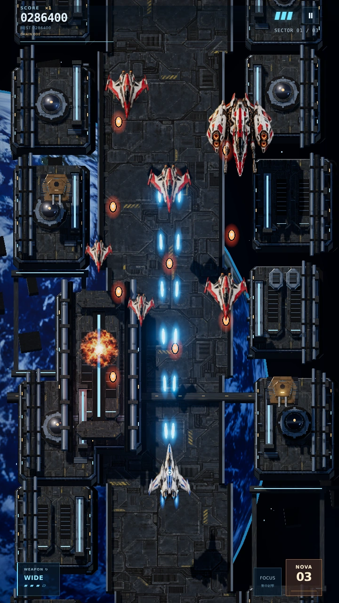
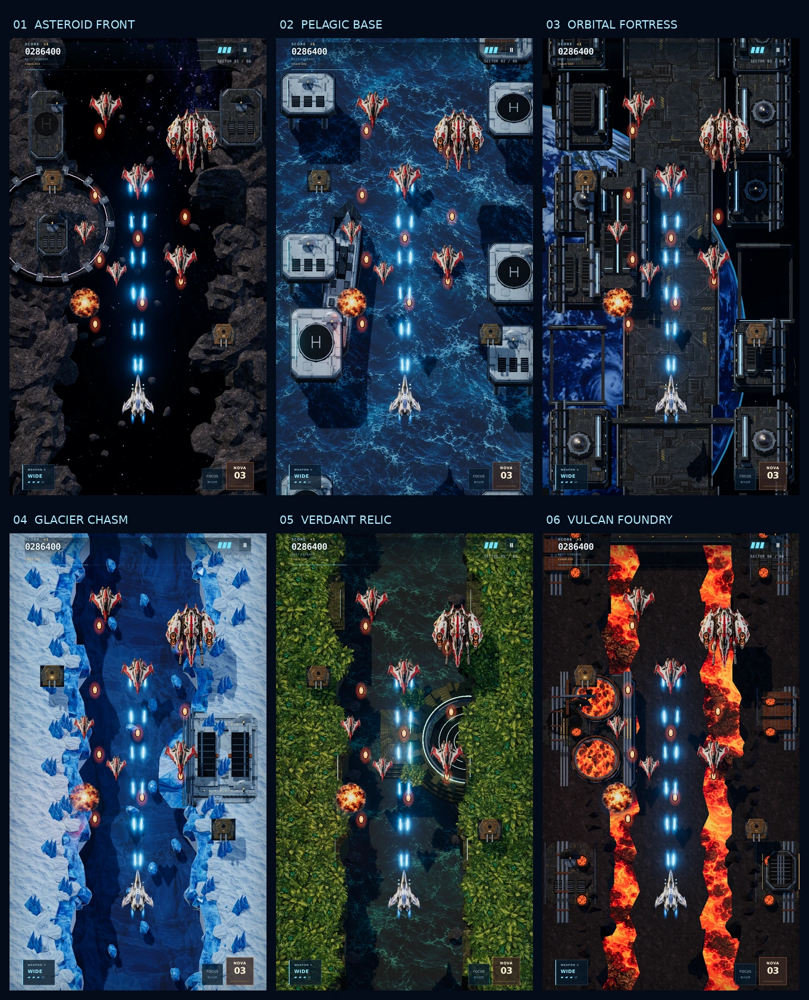
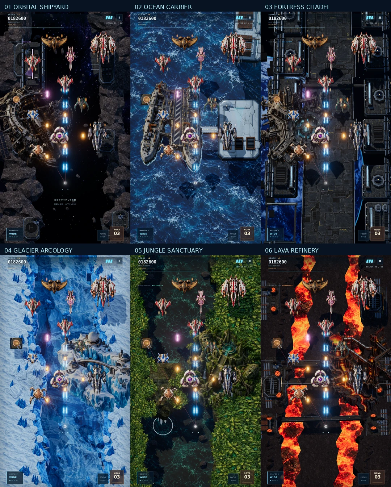
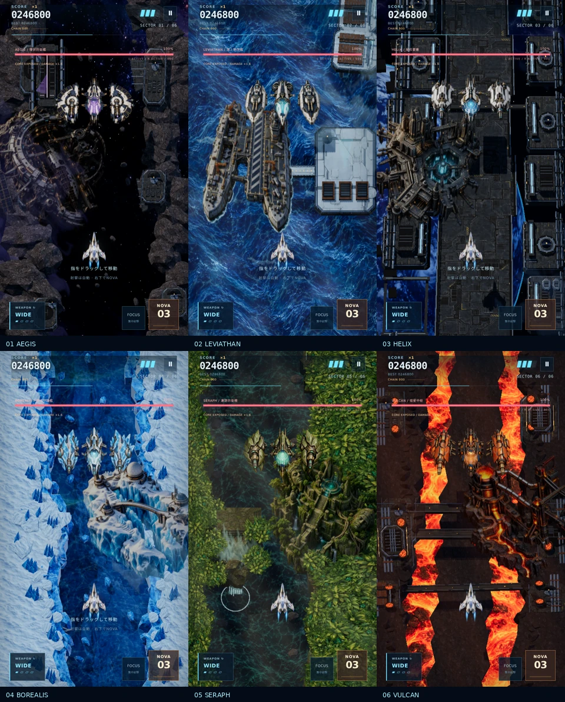

# NOVA STRIKE 2.1

星核を取り戻せ。スマホとPCで遊べる、オリジナルの縦スクロールシューティング。

**Play:** https://yz4git.github.io/newgame3/

高速編隊戦、武器の段階強化、地上目標、秘密のコア、編隊全滅ボーナスを軸にしたアーケード作品です。Star Soldier系のテンポと攻略性を参考に、機体・敵・音楽・背景・ステージを新規に制作しています。

- **Campaign:** 小惑星帯 → 海上基地 → 宇宙要塞 → 氷峡谷 → 密林遺跡 → 溶岩工場。6ステージを選択可能。各ステージに部位破壊を持つ巨大ボス。
- **Caravan:** 120秒のスコアアタック。モード・難易度別に端末へハイスコア保存。
- **3武器:** 広範囲WIDE / 正面火力・貫通LASER / 追尾HOMING。4段階強化と最高レベルの補助機。FOCUSはWIDEで集中、LASERで火力・貫通、HOMINGでロックを強化。
- **NOVA:** 弾消し・全体攻撃・一時無敵。ゲージ満タン時はボムを消費せず約2.7秒間、火力1.35倍のOVERDRIVE。
- **TACTICAL UPDATE:** FOCUSロックオン、旋回を制限した誘導レーザー、蛇行編隊、奇数・偶数の扇状弾、加速狙い弾。敵役割と編成はセクターごとに変化。
- **REACTOR BREAK:** 巡洋艦撃破で周辺の敵へ誘爆、周辺弾を得点へ変換。接近撃破では爆風が広がる。
- **BOSS:** 全6体に専用の3攻撃とHPによる3段階の戦闘変化。防壁、艦隊、レーザー網、氷晶反射、旋回ビット、炉圧で攻略を描き分け。部位破壊で対応する弾・レーザー・護衛を停止し、攻撃後の休止中は本体ダメージ1.6倍。Campaignのボス戦は90秒制限、早期撃破にタイムボーナス。
- **ENCOUNTERS:** 6種類の専用中ボスと、撃破できる回転防壁・艦隊砲台・電源ゲート・反射装置・古代ビット・炉圧弁。予告帯と発射線は当たり判定と同じ位置。護衛を壊すと中ボス本体が露出し、早期撃破後は増援と補給で道中が再開。
- **攻略:** 最大8倍の連続撃破、編隊全滅、接近撃破、弾のかすり、秘密の地上コア。
- **得点:** 接近撃破1.5倍、ロック撃破1.25倍、逃さず集めるメダルは最大5段階。かすりで連鎖の残り時間を維持。
- **VISUAL UPDATE:** 装甲パネル、コックピット、砲口、タービンを新作。金属の環境反射、エンジン炎、爆炎と煙、影、誘導レーザーの軌跡、敵弾の縁・芯、予告線、ロック表示、得点ポップアップ。都市の高層建築、惑星と結晶・遺構、機械星の大型炉でセクターを描き分け。
- **CINEMATIC OPERATIONS:** 6ステージ固有の天候・設備の動作・支援編隊、出撃とボス登場の演出、LYRA / MIRA / ORIONの無線通信。自機の旋回・可動翼・集中射撃・オーバードライブ、敵の照準・射撃反動・ハッチ・回転機構、ボスの装甲開閉と段階的な崩壊。
- **SOUND MIX:** 6ステージ・ボス・タイトルの専用BGM、武器別の効果音、左右の定位、短い残響、重要な攻撃時のBGM調整。全体 / BGM / 効果音の音量を個別に設定・保存。
- **復帰:** 被弾後の無敵・周囲の弾消し・回復用パワーアップ。セクタークリアで耐久とボム補給。
- **PWA:** ホーム画面追加、初回読み込み後のオフライン起動。ファイル名のハッシュとバージョン別キャッシュで更新に対応。

## 操作

| 操作 | スマホ | PC / ゲームパッド |
|---|---|---|
| 移動・自動射撃 | 画面をドラッグ | 矢印 / WASD・左スティック / 十字キー |
| 武器切替 | 左下のWEAPON | C / Xボタン |
| NOVA | 右下 | Space / Xキー・Bボタン |
| 精密移動・集中射撃 | FOCUS長押し | Shift / Aボタン |
| 一時停止 | 右上のⅡ | Esc / P・Start |

iPhoneでは縦画面推奨。移動とNOVA / FOCUSの同時入力に対応。記録はブラウザ・端末単位で保存します。

## 開発

Node.js 24以上を推奨。

```bash
npm ci
npm run dev
npm run check
npm test
npm run build
```

TypeScript / Vite / three.js r186。WebGPUではTSLのブルーム、WebGL 2では標準レンダラーとUnrealBloomPassを使用。GPUを利用できないブラウザでは同じ戦闘システムのCanvas 2D版へ自動的に切り替えます。軽量版も同じ生成した機体素材と3D背景のCPUキャッシュを使用。60 Hzの固定ステップ戦闘、シード付き編隊、移動線分による衝突判定、弾・破片のインスタンシング、端末負荷に応じた解像度・ブルーム・影の調整、オリジナルのステレオBGMとWeb Audioの効果音・空間ミックス。

`app/`が編集用ソース、`public/`がPWA資産です。`npm run build`がルートの`index.html`、`assets/`、`sw.js`を生成します。生成済みファイルとソースを一緒にコミットしてください。実行時CDNは不要です。

`.github/workflows/pages.yml`が`main`の公開用ファイルをGitHub Pagesへデプロイします。GitHub PagesのSourceは**GitHub Actions**を使用します。手動のブランチ公開を使う場合は**main / root**でも動作します。

`?renderer=webgl`でWebGL 2、`?renderer=canvas`で軽量描画を明示できます。テスト用の状態は`window.__nova.snapshot()`、戦闘本体は`window.__nova.game`から確認できます。

## 確認項目

- `npm run check`: TypeScript型チェック
- `npm test`: 高速弾の衝突、NOVAでの緊急回避、被弾復帰、ポーズ、シード再現性、通常射撃で全6ボス撃破・開始ステージ選択、Caravan終了時間、誘導弾の旋回上限、複数ロック、局所誘爆、狙い位置の固定、分離したボス部位の弾消し、ボス時間上限
- ブラウザ: スマホサイズでの表示、移動とNOVAの同時操作、フォーカス、武器切替、ポーズ復帰、画面遷移、描画エラー、オフライン起動

## 権利・参照

既存作品の画像・機体・キャラクター・音楽・ステージデータは使用していません。3Dモデルは手続き的ジオメトリと生成した機体素材を組み合わせます。BGM8曲は独自作曲・音色合成、効果音17系統は独自のWeb Audio用合成です。金属・機体・ボス・惑星・爆発・地形・樹冠などの素材57点は画像生成で新規に制作しています。

three.jsなどの依存ライブラリのライセンスは`THIRD_PARTY_NOTICES.md`をご覧ください。

ゲーム設計では`yz4git/game-core`のリサーチとSTG・遭遇・タッチ操作の設計資料、SBクリエイティブ公開の『シューティングゲーム アルゴリズムマニアックス 新装版』公式サンプルを参照しています。書籍本文の全文を読んだものではありません。参照範囲、設計への反映、検証結果は[研究と更新記録](docs/tactical-update-2026-10-04.md)をご覧ください。

### v1.2 — BG CHIP EDITION

背景をBGチップ方式に刷新。3ステージそれぞれ5区画の長いマップと、合計15か所の大型施設を配置しています。遠景・地表・遠い霞・手前の雲が異なる速度で動き、以前の99単位の背景ループは廃止しました。屋上設備・舗装・配管・タービン・結晶などをチップ化し、軽量描画にも同じ素材を使用します。機体のコックピット枠、吸気口、翼の分割と航法灯も強化しました。

設計・描画予算・検証範囲: [BG-chip overhaul](docs/bg-chip-overhaul-2026-10-04.md)

### v1.2.1 — SPEED 1.5×

ゲーム速度を1.5倍に変更。スクロール、自機・敵・弾・アイテムの移動、編隊の出現、攻撃間隔、ボスの攻撃と演出を同じ倍率で進めます。CARAVANは実時間120秒、ボス制限は実時間90秒で、残り時間表示とプレイ時間の記録も実時間です。

### v1.2.2 — SPEED 2.25×

v1.2.1からゲーム速度をさらに1.5倍に変更し、初期速度比で2.25倍になりました。スクロール・移動・攻撃・出現・演出を共通倍率で加速します。CARAVANとボスの制限時間は引き続き実時間で進みます。

### v1.3 — TEXTURED FORTRESS

ユーザー提供の参考画像に合わせ、暗い金属の宇宙要塞へ画面を刷新。生成した装甲・機体・爆発・惑星のWebP素材7点を使用します。背景は実際の段差・配管・グリル・反射・影を持つ3DのBGチップに変更。床の向きと切り出し、屋上の幅と設備配置を変え、絶対座標でチップを並べる長いマップと15か所の大型施設を維持しています。

遠景0.30×・地表1×・手前の霞1.38×・遠い霞0.16×の多重スクロール、隙間に見える雲を持つ青い惑星、温かい主光と冷たい輪郭光、爆発時の局所光を追加しました。自機・戦闘機・巡洋艦は高精細な透過素材と3Dの影を組み合わせ、地上敵とボスは生成した装甲テクスチャを持つ3Dモデルで描画。弾の発光・爆炎・煙も更新しています。速度は2.25倍を維持しています。

生成プロンプト・資産一覧・描画方法: [Generated artwork](docs/generated-art-v3.md)

描画確認用に配置したシーン（WebGL 2・720×1280）:



検証は型チェック、戦闘・背景・速度の20テスト、WebGL 2とCanvas 2Dでの3ステージ・3ボスの描画、移動とNOVAの同時タッチ、武器切替、ポーズ・リトライ、表示位置と戦闘平面の整合、低負荷設定への移行、実時間の120秒・90秒制限、素材7点を含むオフライン起動。実機のWebGPU / iPhoneでのフレームレートは未測定です。

### v1.4 — SIX WORLDS

5枚の見本から、小惑星帯・海上基地・氷峡谷・密林遺跡・溶岩工場のグラフィックを新作。既存の宇宙要塞を03に置き、見本の番号に合わせて全6ステージにしました。開始ステージを選択でき、選んだ地点から最終ステージまでプレイできます。

新たに画像生成した素材8点を使い、岩塊、海面、氷壁と雪冠、密林の透過樹冠、苔の遺跡、流れる溶岩を描画します。環状基地、潜水艦、ヘリポート、極地施設、滝、古代ゲート、溶鉱炉を立体のBGチップと30か所の大型施設で配置。絶対座標による区画ごとの配置密度、施設の間隔と縦横比を変え、固定マップの繰り返しを避けます。遠景・地形・霞の多重スクロールに加え、水面と溶岩は別の速度で動きます。Canvas版も同じ素材と配置に対応します。速度2.25倍を維持しています。

型チェック・ビルド・21テスト、両描画方式での6ステージとボス、同時タッチ・ステージ選択・ポーズ・リトライ・実時間制限・生成素材15点を含むオフライン起動を確認しました。

構成・生成プロンプト・検証範囲: [Generated environments](docs/generated-environments-v4.md)

描画確認用の配置シーン（WebGL 2・各720×1280）:



### v1.5 — CINEMATIC OPERATIONS

背景・機体・戦闘の動きを連動させました。小惑星帯の回転する環状設備、海上の航跡とヘリ編隊、要塞のレーダーと稼働炉、氷峡谷の雪と霧、密林の揺れる樹冠と覚醒する遺跡、溶岩工場のピストン・噴煙・火の粉を追加。出撃、区画表示、ステージ固有の無線通信、ボス登場、離脱を演出します。

自機は旋回・集中射撃・オーバードライブで姿勢と可動翼、噴射が変化。敵は予備動作・実際の射撃に同期する砲口と反動、狙い方向へ動く砲塔、開閉ハッチ、回転機構を持ちます。ボスは入場時の翼展開、弱点露出に同期した装甲の開閉、撃破後の残骸と連続爆発に対応。Canvas版にも同じ状態の動きを用意しました。ポーズでは演出が止まり、リトライでは演出の時計も初期化します。

型チェック・ビルド・25テスト、両描画方式の6ステージ演出・ボス・同時タッチ・実時間制限・オフライン起動、v1.4からv1.5へのキャッシュ更新を確認しました。

構成・描画予算・検証範囲: [Cinematic operations](docs/cinematic-operations-v5.md)


### v1.6 — EXPANDED VISUALS

新しい透過素材15点を制作し、敵を9種類から14種類へ拡張。迎撃機、爆撃機、護衛艦、浮遊砲台、四脚歩行機が専用の外観・移動・予備動作・攻撃を持ちます。ドローンとランサーも専用素材へ更新。歩行機の脚、浮遊砲台の花弁装甲、爆撃機の翼は画像の一部が実際に変形し、ポーズ中は止まります。

地形区画を8種類から24種類へ増やし、絶対座標に沿った地形の曲がりと幅の変化を追加。生成した大型景観6点と、太陽電池、船体の残骸、クレーター、クレーン、尖塔、橋、古代祭壇、コンベヤーなどの新しい立体景観18か所を配置。全6ステージ合計54か所の大型景観が一度ずつ登場します。海上空母、氷の観測都市、密林の聖域、溶岩の精錬所では航跡・噴煙・光も動きます。

爆発は4コマの生成アトラスで発火→火球→燃焼→残煙へ変化。煙も新作素材を使用。敵のミサイルと菱形弾、6ボスの追加装甲・結晶・船体、背景の雨と流星を強化。Canvas版は同じ素材と関節変形を描き、背景キャッシュをステージごとに解放します。

実装・素材・検証範囲: [Visual expansion](docs/visual-expansion-v6.md)。生成プロンプト: [Asset prompts](docs/generated-art-v6.json)。

描画確認用に配置した6ステージのシーン:




### v1.7 — LIVING WORLDS

画像生成した新素材8点を追加し、海の水面を連続した波形・揺れる光・泡・航跡で動かします。通常描画は水面の頂点・法線・UVが波に追従し、軽量描画は同じ波形を使って境界がつながるテクスチャ帯を描画。光は2層で異なる方向へ流れ、泡は場所・幅・角度を変えながら広がって消えます。海上空母と潜水艦も小さく揺れます。

氷の水面、密林の川、流れる滝と漂う雲、溶岩の脈動と4コマの噴出を追加。機体には細い噴射炎、着弾には4コマのプラズマを使用し、オーバードライブと高速移動では位置履歴から短い残像が出ます。新しい演出は戦闘時計に追従してポーズで止まり、ステージ開始とリトライで初期化します。

実装・検証範囲: [Living worlds](docs/living-worlds-v7.md)。組み込んだ素材の保存先と画像生成プロンプト: [Generated assets](docs/generated-art-v7.json)。

動く海の描画確認: [短いプレビュー動画](docs/living-ocean-v7.mp4)。


### v1.8 — PRODUCTION FINISH

生成したボス6体を全ステージに組み込み、左右の武器部位と本体を独立して描画。入場時の展開、各機体固有の小さな揺れ、砲撃の発光、弱点の装甲開閉、被弾の発光、耐久に応じた焼損、部位破壊、撃破後の崩壊をつなぎました。新しい破片アトラスと有機的な衝撃波に加え、宇宙の星雲、氷のオーロラ、海・密林・溶岩の光を動かします。追加素材12点、合計50点です。

BGMを新作のステレオ音源8曲へ更新。ステージごとに旋律・音色・リズムを変え、ボス曲への1秒クロスフェードとポーズ位置からの再開に対応しました。効果音17系統は武器別の発音、重い爆発、NOVA、部位破壊、ボス崩壊などを持ち、左右の定位・残響・BGMのダッキング・発音数の上限を使用します。タイトルとポーズに音量設定を追加し、全体 / BGM / 効果音を個別に保存します。

実装・検証範囲: [Production finish](docs/production-v8.md)。全生成プロンプトと組み込んだ保存先: [Generated assets](docs/generated-art-v8.json)。音源データ: [Original score](docs/soundtrack-v8.json)。



音付きの描画確認: [短いプレビュー動画](docs/production-v8.mp4)。

### v1.9 — SIX ENCOUNTER CONTROLLERS

6体の巨大ボスを専用制御へ刷新。部位破壊が攻撃・レーザー・護衛・反射・冷却時間へ反映されます。全ステージに固有の中ボスと戦闘イベントを追加し、生成した透明素材7点を両描画方式に組み込みました。中ボスBGMへの切替、撃破効果音、射撃前の通信、撤退と増援のタイミングも連動します。

攻略と検証: [Encounters v1.9](docs/encounters-v9.md) / [生成素材とプロンプト](docs/generated-art-v9.json)

### v1.10 — ENEMY FIRE / PLAYER BALANCE

交差・蛇行編隊の敵が弾を出さない射撃分岐を修正。武器3種の基礎火力、強化曲線、追加弾、ロック補正とOVERDRIVEを調整し、最大強化時の射撃ダメージを約42％削減しました。NOVAはボス・部位・中ボスへのダメージを抑え、弾消しと緊急回避を維持。初期装備での全6ボス・中ボス撃破、全射撃クラス×編隊7種、武器の役割、ボム連打の検証を追加しました。

調整値と実測: [Combat balance v1.10](docs/combat-balance-v10.md)。`node scripts/combat-probe.mjs` で現在の60 Hz固定入力の火力・撃破時間を再測定できます。

### v2.0 — BATTLEFIELD CHAIN

全6ステージに2基ずつ（全12基）の戦略目標を追加。制限時間内の施設破壊は敵弾の消去と周辺への連鎖ダメージ、敵射撃の一時停止を起こします。2基とも破壊すればそのステージのボス兵装耐久が15%低下。一方、施設を逃すと追撃の敵増援が出現し、10ゲーム秒間敵撃破スコアが25%増える代わりに、ボス兵装耐久が10%増加します。各ステージ固有の設備名、演出、リザルト統計を導入。

3機体 STRIKER（標準）、FALCON（速度+16%、火力+8%、初期耐久-1）、BULWARK（速度-12%、火力-7%、初期耐久+1）をタイトル画面で選べます。BOSS RUSHは6体のボス連戦、初期武器レベル3。従来のCAMPAIGNと120秒CARAVANは維持。

機能テスト：`tests/battlefield.test.mjs` を追加。従来のゲーム系回帰テストと一緒に実行。軽量Canvas版とGPU版は同じ戦略目標状態を描画します。

### v2.1 — Generated Art Update

- 生成素材を約75KBのAVIF 6シートへ変換して同梱。オリジナルの高解像度素材は配布用ZIPとして別保存。
- 12種類の戦略施設は、ステージと1基目／2基目の組み合わせで画像を選択。GPU版・Canvas互換版の両方で表示。
- 3種類の自機は単なる着色から個別の外形へ変更。読み込み失敗時には従来の機体描画へ戻す。
- タイトルのシネマティック背景、6ステージの選択プレビュー、戦闘中のセクター紋章、戦場警報／制圧HUDのアイコンを実装。
- スプライトは共通アトラスから切り出し、増え続ける個別テクスチャ読込を回避。Service Worker は生成されたバージョン付きハッシュでキャッシュを更新。
- `tests/generated-art.test.mjs` で実データの形式、ファイル予算、描画ルートとフォールバックを検証。

**生成画像の出典と権利**：今回のバージョン向けに画像生成したオリジナルイラストを加工して使用。敵など既存のゲームアセットを流用した画像ではありません。
