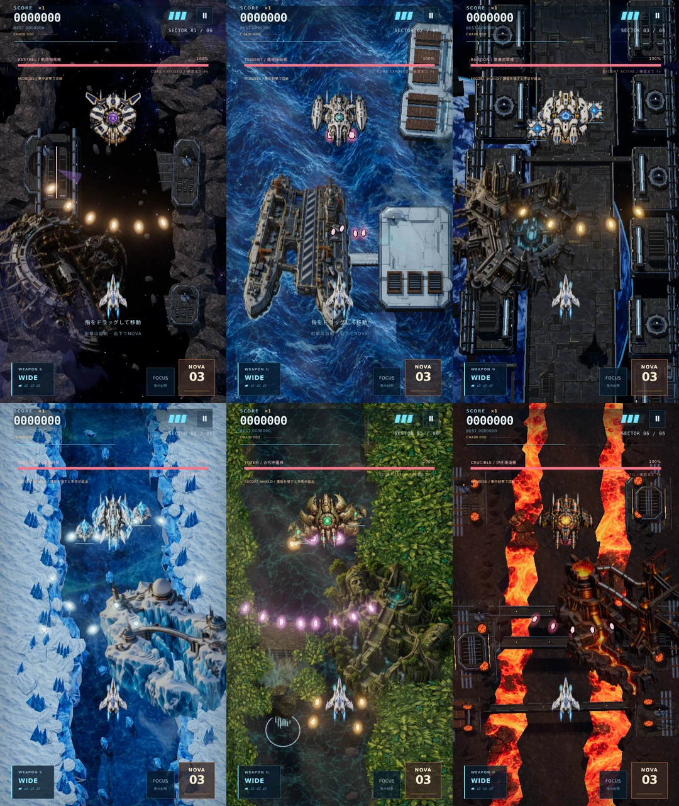

# NOVA STRIKE v1.9 — Encounters

6体の最終ボスにそれぞれ専用の攻撃制御を実装し、6種類の中ボスと、撃破できるステージ設備を追加しました。既存の背景・水面・効果音を使い、道中の状況と攻略を結びつけています。

| セクター | 中ボス / ステージ設備 | 最終ボスの攻略 |
|---|---|---|
| 小惑星帯 | KESTREL / 回転防壁発生器 | 旋回扇状弾、挟撃、照準レーザー。本体防壁は被ダメージ45%。両翼破壊か休止で防壁が開く。 |
| 海上基地 | TRIDENT / 艦隊砲台と護衛コルベット | 艦隊一斉射、加速魚雷、舷側射撃。左右の砲台破壊で対応する弾と護衛砲台を停止。 |
| 宇宙要塞 | BASTION / 電源ゲート | レーザー網、走査砲撃、照準格子。電源・翼の破壊で発生源ごとにレーザーが消える。 |
| 氷峡谷 | MIRROR / 氷晶反射装置 | 反射弾、櫛状弾、交差光槍。反射装置がある間だけ弾が左右の境界で1回反射。 |
| 密林遺跡 | TOTEM / 古代防衛ビット | 軌道ビット、曲がる花弁弾、回避路のある環状波。部位破壊で対応するビットを撤去。 |
| 溶岩工場 | CRUCIBLE / 炉圧弁 | 加速圧力弾、放熱レーザー、炉心連射。翼を壊すほど炉圧が下がり冷却時間が長くなる。 |

## 戦闘と演出

- 各ボスは3攻撃を順番に使用。HP62%・28%で段階が切り替わり、弾・設備・レーザーを整理して短い無敵時間を付与。第3段階はさらに射撃間隔が短くなる。
- 部位・設備ごとに弾とレーザーの発生源を追跡。破壊時に対応する脅威だけを停止する。中ボス護衛が残る間は本体ダメージ70%、護衛破壊後は125%。
- 設備の細いHP表示、機体の傾きとエンジン、装甲防壁、発射前の帯・中心線、発射時の光芯を追加。予告線と当たり判定は同じ固定線分を使用する。予告は最低0.7実秒。
- イベントはステージ時間18%、中ボスは42%で1度登場。通信が終了してから設備が射撃を始める。中ボス登場付近は通常編隊を間引き、早期撃破時は増援と補給が再開する。
- 中ボスは22ゲーム秒（約9.78実秒）で撤退し、本隊への進行を保証する。撃破では得点・パワーアップ・回復を獲得。Caravanは既存の120実秒の構成を維持。
- 中ボス戦はボス曲へクロスフェード。登場、設備通信、撃破に既存のオリジナル効果音を連動。音量設定と一時停止・再開に対応。

## 生成素材

内蔵 `image_gen` で中ボス6枚と、6種類の設備をまとめた透明アトラス1枚を新規生成。元画像の透明度を維持してWebP化し、`app/textures/*-v9.webp` に保存。アトラスは1536×1024、3列×2行、512×512のセル。中ボスは1254×1254。ゲーム内の生成画像は合計57点。GPUのUV切り出しとCanvasの矩形切り出しで同じ画像を使用する。

個別パス・完全な生成プロンプト・モード・バイト数: [generated-art-v9.json](generated-art-v9.json)

## 検証

`npm run check`、`npm test`（55件）、`npm run build` が成功。新しいテストは自然なイベント到達、通常射撃で全中ボス撃破、撤退後の進行、予告中の無害性、線分上のレーザー被弾、部位ごとの停止、氷晶の1回反射、複数ロック、3段階移行、NOVA、ポーズ、再出撃、増援、通信後の射撃を検証する。既存の全6最終ボス通常撃破、時間上限、シード再現性も通過。

Chromiumの480×854でWebGL 2とCanvas 2Dを確認。全6ステージの設備・中ボス・最終ボス、57枚の読み込み、アトラス切り出し、HP表示、PHASE 03、レーザーの予告・発射・設備破壊による停止、一時停止、タイトル復帰を検証。390×844では複数タッチ、武器切替、再出撃、Caravanとボスの実時間制限、オフライン起動を検証。結果: [WebGL](qa-encounters-webgl-v9.json) / [Canvas](qa-encounters-canvas-v9.json)。

音声はブラウザで8曲のMP3復号、ミックス信号、17系統の効果音、定位、ミュート、音量保存、24ボイス上限、一時停止からの再開位置、中ボス曲への往復を確認。音を聴いての評価は実施していない。WebGLはソフトウェア描画による機能検証であり、実機iPhoneやハードウェアWebGPUのフレームレート評価は含まない。
